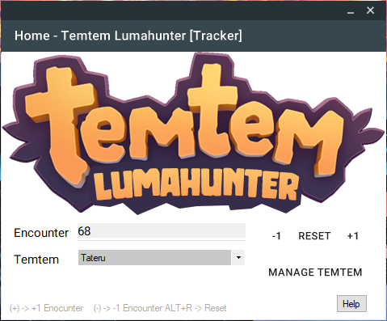

# Temtem Luma Hunter (Encounter Tracker)

 
**Lumahunter** is a simple tool to count your random **encounters**, while you are hunting a specific temtem. You simply start the tool, add your temtem and start hitting ("+") to count. The program can run in the background. The progress is saved in .txt file, so for Streamers interesting (OBS can read txt files and show them in stream).

